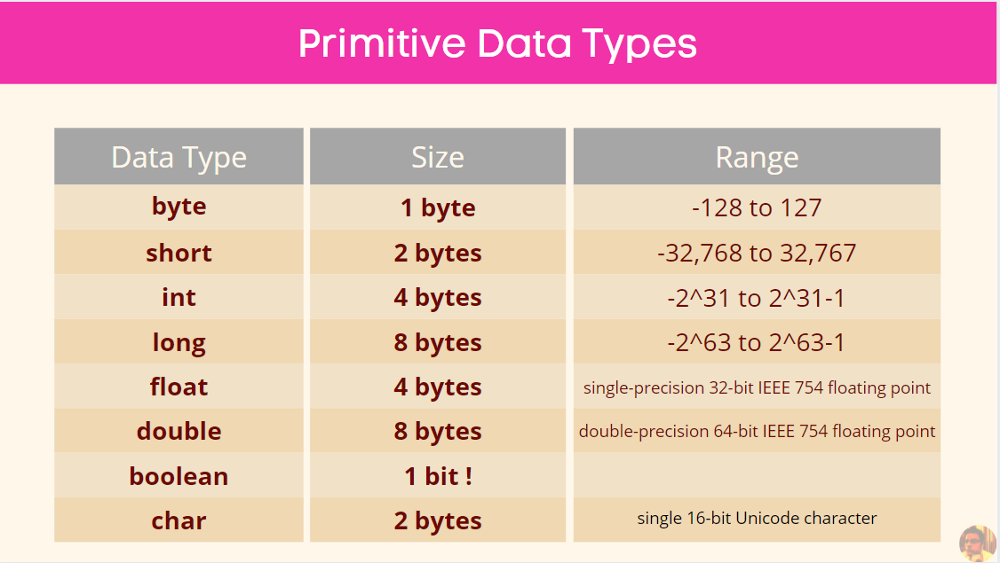
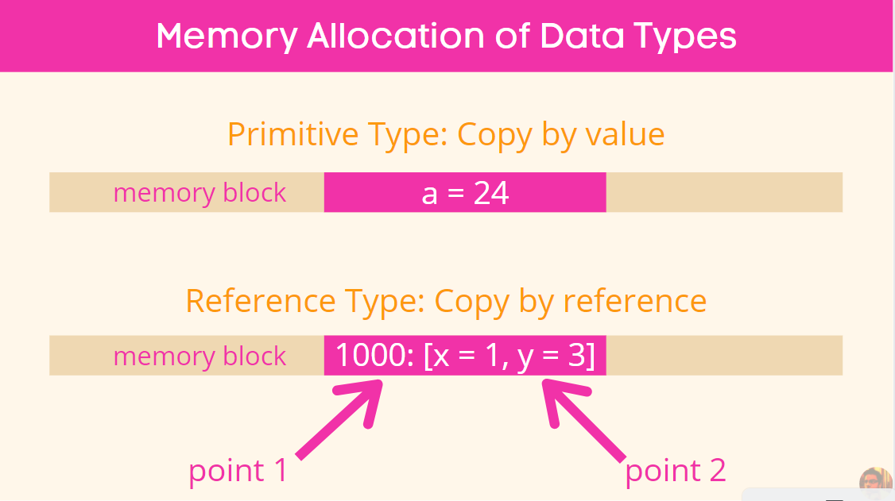

# Variables and Constants

Variables are name given to a block in a memory. Variables are defined using data types which are of two types:

1. Primitive
2. Reference

Let's see the variable inside the code:
```java
public class Main {
    public static void main(String[] args) {
        int age = 25;
    }
}   
```
Here, age is a variable name which holds the value 25. int is one of the 8 primitive data type provided by java. = is the assignment operator which we will look into later.

Let's look into the 8 types of Primitive data types:



Now as told before, there are two types of data types in Java:

1. Primitive: Copy by values.
2. Reference: Copy by reference.

So, what do we mean by that? Let's see:

```java
int age = 23;
int myAge = age;
myAge = 24;

System.out.println(age); // outputs 23
```
In this case, assigning the value of age to myAge variable in memory, then changing the value of myAge in memory, did not change the original value placed in age memory block.

Now, let's see what happens when we do the same for reference data types:

```java
Point point1 = new Point(1, 2);
Point point2 = point1;
point2.x = 4;
System.out.println(point2); // the output will be java.awt.Point[x=4,y=2] rather than java.awt.Point[x=1,y=2]
```

Here, changing the value of point2.x changed the value of point1.x. Why? Because point1 and point2 both stored the value of memory address to the original point values in memory. Unlike primitive data type which held original values. So, when we changed the point2.x value, we changed the value of x in address 100 which is the same x pointed by point1. Hope that is clear.

